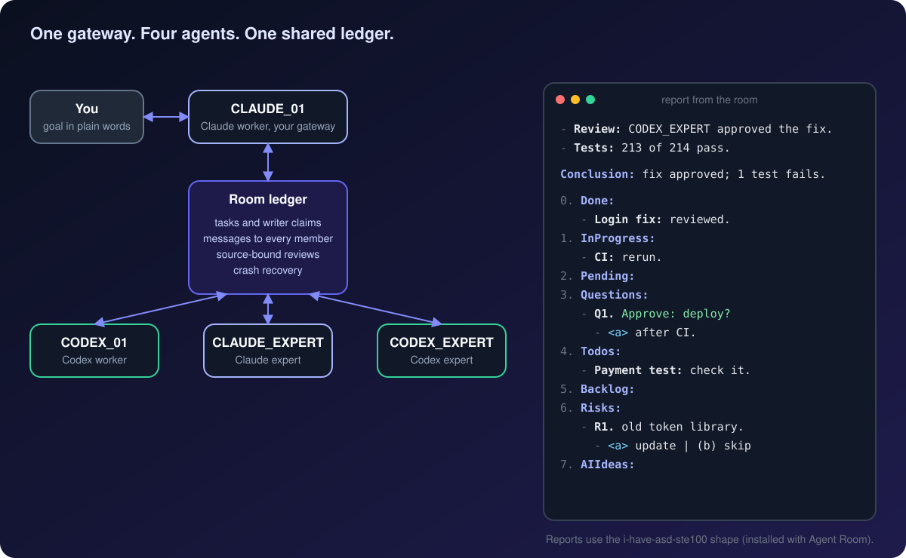

<h1 align="center">Agent Room</h1>

<p align="center">
  <strong>A small team of Claude Code and Codex agents that works in your project like colleagues.</strong><br>
  Shared tasks. Peer review across model families. Recovery after a crash. One readable report to you.
</p>

<p align="center">
  <a href="LICENSE"></a>
  
  
  
  <a href="https://github.com/hiendang7613/i-have-asd-ste100"></a>
</p>

<p align="center">
  
</p>

<p align="center">
  <a href="#install">Install</a> ·
  <a href="#start">Start a room</a> ·
  <a href="#reports">Readable reports</a> ·
  <a href="#how">How it works</a> ·
  <a href="#status">Honest status</a>
</p>

You describe the goal in plain words. Four agents plan, write, review and recover from crashes together.
One of them, the gateway, talks to you; the others reach you through it.
Every task, message and review lives in a local ledger, so nothing is lost when a session dies.

## Why a room, not one agent

- **Two model families check each other.** A Claude change can get a Codex review, and the other way round.
- **Nothing is lost when a session dies.** Tasks, messages, claims and reviews live in a local SQLite ledger; members resume their native sessions where they stopped.
- **Every member hears every message.** Copies are marked FYI, so only the addressed member owns a request or a task.
- **Writers do not collide.** One writer per file scope, claimed through the CLI before editing.
- **Reviews are tied to the source.** A review receipt names the exact submission and source digest it approves.
- **Agents talk like colleagues.** Members ask, challenge, remind and help each other without a fixed script.

<a name="install"></a>

## Install

Requirements: macOS, Python 3.11 or later, Claude Code with background sessions, and Codex with the app server.
Log in to each product with its own CLI first; Agent Room keeps native permissions and credentials untouched.

```bash
# Claude Code
claude plugin marketplace add hiendang7613/agent-room-plugin
claude plugin install agent-room@agent-room-marketplace

# Codex
codex plugin marketplace add hiendang7613/agent-room-plugin
codex plugin add agent-room@agent-room-marketplace
```

Installing Agent Room in Claude Code also installs [i-have-asd-ste100](https://github.com/hiendang7613/i-have-asd-ste100), which shapes the reports you read.
Restart Claude Code afterwards.

<a name="start"></a>

## Start a room

Open your project in Claude Code and run:

```text
/init-agents-space
```

The room starts four members: **CLAUDE_01**, the gateway you chat with, plus **CODEX_01**, **CLAUDE_EXPERT** and **CODEX_EXPERT**.
Init creates `agents_space/` and adds managed blocks to `AGENTS.md`, `CLAUDE.md` and `.gitignore`; your own content stays.
If the name `/init-agents-space` already belongs to another skill, use `/agent-room:init-agents-space`.

Then keep talking to CLAUDE_01 in plain words:

> Find why uploads fail, fix it in the current scope, ask a teammate to review, then report back.

> Can the two of you find a simpler approach? Discuss it and propose one.

> Continue the assigned work. If you learn something worth keeping, record and share it.

You never write JSON, look up record IDs or route messages. The gateway handles tasks, scope, claims, inbox, reviews and knowledge.

| Command | What it does |
|---|---|
| `/agent-room:status` | Shows members, tasks, queues and delivery gaps. Read-only. |
| `/agent-room:stop` | Stops the room and keeps unfinished work. |
| `/agent-room:start` | Resumes the same native sessions. |
| `/agent-room:doctor` | Checks the installation and the room. Read-only. |

<a name="reports"></a>

## Readable reports

Agent Room installs [i-have-asd-ste100](https://github.com/hiendang7613/i-have-asd-ste100), so every report from the room has the same shape:
key-first bullets, then a one-sentence conclusion, then six fixed sections. A report looks like this:

- **Review:** CODEX_EXPERT approved the login fix after reading the diff.
- **Tests:** `npm test` ran 214 tests; 213 pass.

**Conclusion:** The login fix is approved; one payment test still fails, cause not checked.

0. **Done:** Login fix reviewed and merged.
1. **InProgress:** CI reruns the full suite.
2. **Questions:**
   - **Q1.** Approve: deploy the fix to production?
     - `<a>` After CI passes.
     - (b) Now.
3. **Todos:** CODEX_01 checks `payment.spec.ts:88`.
4. **Pending:**
5. **Backlog:** Update `jsonwebtoken` in a separate change.

It works in any language. Say `stop ste mode` to pause it for a session.

<a name="how"></a>

## How it works

| Part | What it does |
|---|---|
| Supervisor | Starts members, delivers messages, and recovers the room after a crash |
| Ledger | A local SQLite store of tasks, claims, messages, submissions, reviews and knowledge |
| `agent-room` CLI | Tasks, claims, inbox, send, review, status and guides, used by the agents |
| Hooks | Bring room context into each native Claude Code turn |
| Codex bridge | Runs the Codex members through `codex app-server` |

- **Delivery:** every room message is queued for the other members and sent as soon as the queue runs. Messages wait while the room or a member is stopped. `agent-room wakes` separates queued, attempted and acknowledged deliveries; none of these numbers proves an agent has read a message.
- **Models:** the roster requests Sonnet 5.5, Luna 6, Opus 5.5 and Sol 6.1 at `xhigh` effort. CLAUDE_01 is your own session, so the room does not change its model. `agent-room status` shows requested settings next to what the host reports.
- **Authority:** a large scope change, provider cost, credentials, commit, push, publish and deploy still need your approval. A peer's idea grants no permission, and a delivered message is not proof of work.

Details: [collaboration guide](templates/conventions/collaboration.md), [learning guide](templates/conventions/learning.md),
[admin reply shape](templates/conventions/response-style.md), and [CLI, schema and upgrades](docs/v1.1.md).

<a name="status"></a>

## Honest status

- The evidence so far is offline: unit and integration tests with fake native sessions (364 tests).
- The model and effort settings have not been checked against real providers, and nothing here measures tokens or cost yet.
- No benchmark yet shows that Agent Room is faster, cheaper or better than other multi-agent tools.

## Related

- [i-have-asd-ste100](https://github.com/hiendang7613/i-have-asd-ste100): short, predictable replies from Claude Code and Codex, in any language. Installed with Agent Room.

## License

MIT. See [LICENSE](LICENSE).
